 

 

> A **fully functional private server Discord bot ecosystem** — built for performance, scalability, and full control. Featuring moderation, general utilities, event logging, game integration, and server-specific systems.

---

## 📑 Table of Contents

- [✨ Features](#-features)
- [🏗️ Stack](#️-stack)
- [⚡ Ecosystem System Architecture Workflow](#-ecosystem-system-architecture-workflow)
- [⚙️ Tech & Acknowledgments](#️-tech--acknowledgments)
- [👥 Developers](#-developers)
- [🤝 Support](#-support)
- [💛 Donate](#-donate)
- [📄 License](#-license)

---

## ✨ Features

| Feature | Description |
|---|---|
| 🛡️ **Moderation Commands** | Powerful tools to keep your server safe and well-managed |
| 🎉 **General Commands** | Fun and utility commands for everyday server use |
| ⚙️ **Server-Specific Systems** | Custom-built systems tailored to your server's needs |
| 📋 **Event Logging** | Comprehensive logging of all server events to dedicated channels |
| 🎮 **Game Integration** | Interactive games, events, and full data management |

---

## 🏗️ Stack

The SHoNgxBoNg ecosystem is composed of several specialized services working together:

<table>
  <thead>
    <tr>
      <th>Project</th>
      <th>Description</th>
    </tr>
  </thead>
  <tbody>
    <tr>
      <td><a href="https://github.com/1SHoNgxBoNg/SHoNgDashboard"><b>🖥️ SHoNgDashboard</b></a></td>
      <td>A comprehensive web dashboard for controlling and managing the bot's database</td>
    </tr>
    <tr>
      <td><a href="https://github.com/1SHoNgxBoNg/ShongAPI"><b>🔌 SHoNgAPI</b></a></td>
      <td>Core API that serves the main bot and enables inter-bot communication</td>
    </tr>
    <tr>
      <td><a href="https://github.com/1SHoNgxBoNg/SHoNgBotV4"><b>🤖 SHoNgBotV4</b></a></td>
      <td>Advanced private system bot engineered for performance, scalability, and full control</td>
    </tr>
    <tr>
      <td><a href="https://github.com/1SHoNgxBoNg/ShongLogix"><b>📝 SHoNgLogix</b></a></td>
      <td>Captures and forwards all server events to their respective log channels</td>
    </tr>
    <tr>
      <td><a href="https://github.com/1SHoNgxBoNg/ShongArena"><b>🎮 SHoNgArena</b></a></td>
      <td>Easily create and manage games and events within your Discord server</td>
    </tr>
    <tr>
      <td><a href="https://github.com/1SHoNgxBoNg/ShongArenaData"><b>📦 SHoNgArenaData</b></a></td>
      <td>Static data and asset files powering the SHoNgArena bot</td>
    </tr>
    <tr>
      <td><a href="https://github.com/1SHoNgxBoNg/ShongTemplate"><b>🧩 SHoNgTemplate</b></a></td>
      <td>A clean base handler template used as the foundation for all other bots</td>
    </tr>
  </tbody>
</table>

---

## ⚡ Ecosystem System Architecture Workflow

A high-level overview of how all services, bots, and data layers interconnect across the SHoNgxBoNg ecosystem.

```mermaid
flowchart TD
    %% Users & Inputs
    DiscordUsers[Discord Server Members] <--> |Gateway Interactions & Commands| Bots[Discord Bot Clients]
    WebAdmins[Server Administrators] <--> |HTTPS UI / Next.js| Dashboard[SHoNgDashboard / Next.js Admin Portal]
    Webhooks[Payment Platforms / Kofi & Patreon] --> |JSON Webhooks| WebhookReceiver[Webhooks & API Endpoint Receivers]
    %% Dashboard App
    subgraph DashboardApp [SHoNgDashboard: Next.js Admin Web App]
        Dashboard --> |Supabase SSR Auth| SupabaseAuth[Supabase Auth / SSR]
        Dashboard --> |MongoDB Node Driver| MongoDashboard[MongoDB Driver]
        Dashboard --> |Resend / Nodemailer| Resend[Nodemailer / SMTP Alerts]
    end
    %% Webhook Receiver Routing
    WebhookReceiver --> |Ko-fi / Patreon Payloads| SHoNgAPI[SHoNgAPI / NestJS Microservice]
    WebhookReceiver --> |Role Sync & Expire Events| FastifyV4[SHoNgBotV4 / Fastify Web Server]
    %% Bot Clients
    subgraph Bots [Discord Bot Ecosystem Client Layer]
        SHoNgBotV4[🤖 SHoNgBotV4 - Main Systems Bot]
        SHoNgArena[🎮 SHoNgArena - Visual Interface Bot]
        SHoNgLogix[📝 SHoNgLogix - Event Auditor & SQL Console]
    end
    %% Bot Internal Engine Details
    SHoNgBotV4 --> |Dynamic Temp Voice / Islamic Crons / Staff Shifts / Tickets| BotV4Core[BotV4 Engine]
    SHoNgArena --> |QuickChart-js / Local Canvas / Command Route| ArenaCore[Arena Engine]
    SHoNgLogix --> |Gateway Audits / SQL Terminal / AI Skills| LogixCore[Logix Engine]
    %% NestJS API
    subgraph APIService [SHoNgAPI: NestJS Backend Microservice]
        SHoNgAPI --> |Fastify Adapter| APIFastify[Fastify Server]
        SHoNgAPI --> |Rust @napi-rs/canvas & sharp| RenderEngine[Graphics Rendering Engine]
        SHoNgAPI --> |Cache Manager| APICache[In-Memory Cache]
    end
    %% Integrations Between Components
    SHoNgBotV4 <--> |REST API Requests / Render Card Triggers| SHoNgAPI
    SHoNgArena <--> |Fetch Rendered Profile & Stats Cards| SHoNgAPI
    Dashboard <--> |Request Transcripts / Web API| FastifyV4
    %% Shared Databases
    subgraph Databases [Shared Data Storage Layer]
        MongoDB[(MongoDB Atlas - Schemaless Docs)]
        PostgreSQL[(PostgreSQL / Supabase Relational)]
        Redis[(Redis Cache - Ephemeral / States)]
    end
    %% Database Connections
    MongoDashboard <--> MongoDB
    BotV4Core <--> MongoDB
    BotV4Core <--> |Prisma ORM / Supabase Batcher| PostgreSQL
    BotV4Core <--> Redis
    ArenaCore <--> MongoDB
    ArenaCore <--> Redis
    LogixCore <--> MongoDB
    LogixCore <--> |Prisma ORM / pg pool| PostgreSQL
    SHoNgAPI <--> MongoDB
    SHoNgAPI <--> Redis
```

---

## ⚙️ Tech & Acknowledgments

This project is built on top of a solid modern stack:

---

## 👥 Developers

| Developer | GitHub |
|---|---|
| **ShkourBashtawi** |  |
| **ArrioProgrammer** |  |
| **PHANTOM** |  |

---

## 🤝 Support

Have a question or need help? We're here for you:

- 🐛 **Open an Issue** — [Report a bug or request a feature](https://github.com/1SHoNgxBoNg/SHoNgBotV4/issues)
- 💬 **Join our Discord** — [discord.gg/sxb](https://discord.gg/sxb) for real-time support

---

## 💛 Donate

If you find this project useful and would like to support its continued development, a donation means a lot to us!

---

## 📄 License

This project is licensed under the **MIT License**.
See the [LICENSE](https://choosealicense.com/licenses/mit) file for full details.

---

Made with ❤️ by the SHoNgxBoNg team

