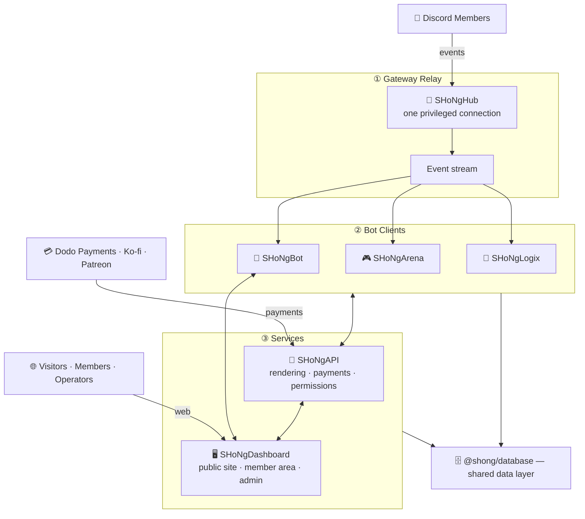

 

 

> Seven services that run one Discord community: a shared gateway relay, three bots, a rendering API,
> a shared data layer, and a web platform — built for performance, scalability, and full control.

---

## 📑 Table of Contents

- [✨ What the Ecosystem Does](#-what-the-ecosystem-does)
- [🏗️ Projects](#️-projects)
- [⚡ How It Fits Together](#-how-it-fits-together)
- [⚙️ Tech & Acknowledgments](#️-tech--acknowledgments)
- [👥 Developers](#-developers)
- [🤝 Support](#-support)
- [💛 Donate](#-donate)
- [🔒 Privacy Policy](#-privacy-policy)
- [📄 License](#-license)

---

## ✨ What the Ecosystem Does

| Area | Description |
|---|---|
| 🛡️ **Moderation & Auditing** | Warnings, timeouts, bans, bulk cleanup, and a full audit trail of every gateway event |
| 🎮 **Games & Events** | 27 single-player games, 2 duo games, and 9 multiplayer systems (Bank, Mafia, Codenames, Roulette, Hide & Seek, Chairs, Geo, Party, Stop) |
| 💰 **Economy & Leveling** | Dual-currency wallets, XP from text and voice, daily streaks, transfers with a risk engine, and clan credit |
| 🎙️ **Dynamic Voice Rooms** | Join-to-create channels with privacy controls, trust/block lists, room codes, and protection perks |
| 🎫 **Tickets & Staff Ops** | Auto-routed support tickets with hosted HTML transcripts, staff activity scoring, and vacation management |
| 💳 **Subscriptions & Gifts** | Four tiers (Starter, Pro, Elite, Ultimate) driven by Dodo Payments, Ko-fi and Patreon webhooks, with role sync, grace periods, gift codes, and status cards |
| 🖼️ **Server-Side Rendering** | Every card, chart, and game board is drawn server-side by the API and delivered to Discord as an image |
| 🛂 **Command Permissions** | One authority for who may run which command, edited from the dashboard and applied across every bot |
| 🎨 **Profiles & Cosmetics** | Badges, frames, backgrounds, effects and colorways over a member-designed profile card layout |
| 🌍 **Public Site & Member Area** | A bilingual English/Arabic website with leaderboards, pricing and checkout, plus a member area for billing, cosmetics and personal stats |
| 📊 **Web Administration** | A Next.js admin portal over the whole data layer, with two-step sign-in and role-based access control |

---

## 🏗️ Projects

<table>
  <thead>
    <tr>
      <th>Project</th>
      <th>Role</th>
      <th>Stack</th>
    </tr>
  </thead>
  <tbody>
    <tr>
      <td><a href="https://github.com/1SHoNgxBoNg/SHoNgHub"><b>📡 SHoNgHub</b></a></td>
      <td>Gateway event relay. Holds the single privileged-intent Discord connection and fans events out to every bot over Redis Streams</td>
      <td>@discordjs/ws · Fastify · Redis Streams</td>
    </tr>
    <tr>
      <td><a href="https://github.com/1SHoNgxBoNg/SHoNgBot"><b>🤖 SHoNgBot</b></a></td>
      <td>Main systems bot — temp voice, tickets, clans, staff, economy, subscriptions, and scheduled jobs</td>
      <td>discord.js · Fastify · Postgres · Redis</td>
    </tr>
    <tr>
      <td><a href="https://github.com/1SHoNgxBoNg/SHoNgArena"><b>🎮 SHoNgArena</b></a></td>
      <td>Games and events client — 38 games, profiles, leaderboards, whispers, and the transfer/wallet risk engine</td>
      <td>discord.js · Redis · Supabase</td>
    </tr>
    <tr>
      <td><a href="https://github.com/1SHoNgxBoNg/SHoNgLogix"><b>📝 SHoNgLogix</b></a></td>
      <td>Event auditor — captures 32 gateway events into log channels and keeps the long-term record the statistics are built from. Also runs OCR scam detection on images</td>
      <td>discord.js · PostgreSQL · Tesseract.js</td>
    </tr>
    <tr>
      <td><a href="https://github.com/1SHoNgxBoNg/SHoNgAPI"><b>🔌 SHoNgAPI</b></a></td>
      <td>Backend microservice — renders every card and game board, handles subscription payments, and answers who may run which command</td>
      <td>NestJS · Fastify · Rust canvas · sharp</td>
    </tr>
    <tr>
      <td><a href="https://github.com/1SHoNgxBoNg/SHoNgDashboard"><b>🖥️ SHoNgDashboard</b></a></td>
      <td>The web platform — a bilingual public site, a member account area with checkout and cosmetics, and a 34-page admin portal</td>
      <td>Next.js 16 · React 19 · Tailwind v4</td>
    </tr>
    <tr>
      <td><a href="https://github.com/1SHoNgxBoNg/SHoNgDatabase"><b>🗄️ SHoNgDatabase</b></a></td>
      <td>Shared data layer — schemas, economy configuration, subscription tiers, cosmetics, and the game-statistics engine. Imported by all five services above, so a change lands everywhere at once</td>
      <td>TypeScript · Mongoose</td>
    </tr>
  </tbody>
</table>

---

## ⚡ How It Fits Together

One Discord application holds the privileged intents; everything else works from relayed events.
The system reads top to bottom in four layers.

```mermaid
flowchart TD
    Members["👥 Discord Members"]
    Web["🌐 Visitors · Members · Operators"]
    Pay["💳 Dodo Payments · Ko-fi · Patreon"]

    subgraph Relay ["① Gateway Relay"]
        Hub["📡 SHoNgHub<br/>one privileged connection"]
        Stream["Event stream"]
        Hub --> Stream
    end

    subgraph Clients ["② Bot Clients"]
        direction LR
        Bot["🤖 SHoNgBot"]
        Arena["🎮 SHoNgArena"]
        Logix["📝 SHoNgLogix"]
    end

    subgraph Services ["③ Services"]
        direction LR
        API["🔌 SHoNgAPI<br/>rendering · payments · permissions"]
        Dash["🖥️ SHoNgDashboard<br/>public site · member area · admin"]
    end

    Shared["🗄️ @shong/database — shared data layer"]

    Members -->|events| Hub
    Web -->|web| Dash
    Pay -->|payments| API

    Stream --> Bot
    Stream --> Arena
    Stream --> Logix

    Clients <--> API
    Bot <--> Dash
    API <--> Dash

    Clients --> Shared
    Services --> Shared
```

### The four ideas behind it

**One gateway connection.** Three bots used to open three connections asking Discord for the same
events. Now a single relay listens once and passes each event on, and every bot still acts on
Discord under its own identity.

**One place that draws.** No bot renders images itself. Every profile card, leaderboard, game board
and chart is produced by the API, so a design change ships once instead of three times.

**One shared data layer.** Schemas, prices, cosmetics and statistics live in a single package that
every service imports, which is what keeps five codebases telling the same story.

**One authority for permissions.** A bot asks whether a caller may run a command; it never decides
on its own. Server owners manage that from the dashboard, and it applies everywhere.

---

## ⚙️ Tech & Acknowledgments

---

## 👥 Developers

| Developer | GitHub |
|---|---|
| **ShkourBashtawi** |  |
| **ArrioProgrammer** |  |
| **PHANTOM** |  |

---

## 🤝 Support

- 🐛 **Open an Issue** — [Report a bug or request a feature](https://github.com/1SHoNgxBoNg/SHoNgBot/issues)
- 💬 **Join our Discord** — [discord.gg/sxb](https://discord.gg/sxb) for real-time support

---

## 💛 Donate

If you find this project useful and would like to support its continued development, a donation means a lot to us!

---

## 🔒 Privacy Policy

- [SHoNgxBoNg Bot Privacy Policy](https://github.com/1SHoNgxBoNg/.github/blob/main/profile/SHoNgxBoNg_bot.md)
- [SHoNgArena Privacy Policy](https://github.com/1SHoNgxBoNg/.github/blob/main/profile/arena_privacy.md)

---

## 📄 License

All projects in this ecosystem are licensed under the **MIT License**.

---

Made with ❤️ by the SHoNgxBoNg team

