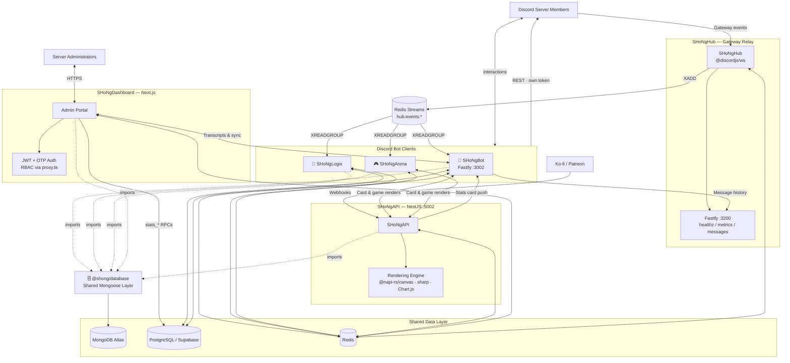

<div align="center">


<br/>

[](https://discord.gg/sxb)
[](https://choosealicense.com/licenses/mit)
[](https://www.typescriptlang.org/)
[](https://nodejs.org/)
[](https://paypal.me/shkour)

<br/>

> Seven services that run one Discord community: a shared gateway relay, three bots, a rendering API,
> a shared data layer, and an admin dashboard — built for performance, scalability, and full control.

</div>

---

## 📑 Table of Contents

- [✨ What the Ecosystem Does](#-what-the-ecosystem-does)
- [🏗️ Projects](#️-projects)
- [⚡ Architecture](#-architecture)
- [🔑 How the Pieces Connect](#-how-the-pieces-connect)
- [⚙️ Tech & Acknowledgments](#️-tech--acknowledgments)
- [👥 Developers](#-developers)
- [🤝 Support](#-support)
- [💛 Donate](#-donate)
- [🔒 Privacy Policy](#-privacy-policy)
- [📄 License](#-license)

---

## ✨ What the Ecosystem Does

| Area | Description |
|---|---|
| 🛡️ **Moderation & Auditing** | Warnings, timeouts, bans, bulk cleanup, and a full audit trail of every gateway event |
| 🎮 **Games & Events** | 27 single-player games, 2 duo games, and 8 multiplayer systems (Mafia, Codenames, Roulette, Hide & Seek, Chairs, Geo, Party, Stop) |
| 💰 **Economy & Leveling** | Dual-currency wallets, XP from text and voice, daily streaks, transfers with a risk engine, and clan credit |
| 🎙️ **Dynamic Voice Rooms** | Join-to-create channels with privacy controls, trust/block lists, room codes, and protection perks |
| 🎫 **Tickets & Staff Ops** | Auto-routed support tickets with hosted HTML transcripts, staff activity scoring, and vacation management |
| 💳 **Subscriptions** | Ko-fi and Patreon webhooks across four tiers (Starter, Pro, Elite, Ultimate), with role sync, grace periods, and status cards |
| 🖼️ **Server-Side Rendering** | Every card, chart, and game board is drawn server-side by the API and delivered to Discord as an image |
| 📊 **Web Administration** | A Next.js dashboard over the whole data layer, with role-based access control |

---

## 🏗️ Projects

<table>
  <thead>
    <tr>
      <th>Project</th>
      <th>Role</th>
      <th>Stack</th>
    </tr>
  </thead>
  <tbody>
    <tr>
      <td><a href="https://github.com/1SHoNgxBoNg/SHoNgHub"><b>📡 SHoNgHub</b></a></td>
      <td>Gateway event relay. Holds the single privileged-intent Discord connection and fans events out to every bot over Redis Streams</td>
      <td>@discordjs/ws · Fastify · Redis Streams</td>
    </tr>
    <tr>
      <td><a href="https://github.com/1SHoNgxBoNg/SHoNgBot"><b>🤖 SHoNgBot</b></a></td>
      <td>Main systems bot — temp voice, tickets, clans, staff, economy, subscriptions, and scheduled jobs</td>
      <td>discord.js · Fastify · Postgres · Redis</td>
    </tr>
    <tr>
      <td><a href="https://github.com/1SHoNgxBoNg/SHoNgArena"><b>🎮 SHoNgArena</b></a></td>
      <td>Games and events client — 37 games, profiles, leaderboards, whispers, and the transfer/wallet risk engine</td>
      <td>discord.js · Redis · Supabase</td>
    </tr>
    <tr>
      <td><a href="https://github.com/1SHoNgxBoNg/SHoNgLogix"><b>📝 SHoNgLogix</b></a></td>
      <td>Event auditor — captures 32 gateway events into log channels and warehouses them in Postgres. Also runs OCR scam detection on images</td>
      <td>discord.js · Postgres · Tesseract.js</td>
    </tr>
    <tr>
      <td><a href="https://github.com/1SHoNgxBoNg/SHoNgAPI"><b>🔌 SHoNgAPI</b></a></td>
      <td>Backend microservice — renders every card and game board, and receives the Ko-fi and Patreon webhooks</td>
      <td>NestJS · Fastify · Rust canvas · sharp</td>
    </tr>
    <tr>
      <td><a href="https://github.com/1SHoNgxBoNg/SHoNgDashboard"><b>🖥️ SHoNgDashboard</b></a></td>
      <td>Admin web portal — 33 pages over the full data layer, with JWT + OTP auth and role-based access control</td>
      <td>Next.js 16 · React 19 · Tailwind v4</td>
    </tr>
    <tr>
      <td><a href="https://github.com/1SHoNgxBoNg/SHoNgDatabase"><b>🗄️ SHoNgDatabase</b></a></td>
      <td>Shared Mongoose schemas, models, economy config, subscription tiers, and the game-stats engine. Imported by all five services above</td>
      <td>TypeScript · Mongoose</td>
    </tr>
  </tbody>
</table>

---

## ⚡ Architecture

One Discord application holds the privileged intents. Everything else consumes relayed events.


```mermaid
flowchart TD
    %% External actors
    Members[Discord Server Members]
    Admins[Server Administrators]
    Payments[Ko-fi / Patreon]

    %% The relay
    subgraph HubLayer [SHoNgHub — Gateway Relay]
        Hub["SHoNgHub<br/>@discordjs/ws"]
        HubAPI[Fastify :3200<br/>healthz / metrics / messages]
        Hub --> HubAPI
    end

    Streams[(Redis Streams<br/>hub:events:*)]

    %% Bot clients
    subgraph Bots [Discord Bot Clients]
        direction LR
        Bot[🤖 SHoNgBot<br/>Fastify :3002]
        Arena[🎮 SHoNgArena]
        Logix[📝 SHoNgLogix]
    end

    %% API
    subgraph APILayer [SHoNgAPI — NestJS :5002]
        API[SHoNgAPI]
        Render["Rendering Engine<br/>@napi-rs/canvas · sharp · Chart.js"]
        API --> Render
    end

    %% Dashboard
    subgraph DashLayer [SHoNgDashboard — Next.js]
        Dash[Admin Portal]
        Auth[JWT + OTP Auth<br/>RBAC via proxy.ts]
        Dash --> Auth
    end

    %% Shared package
    SharedDB["🗄️ @shong/database<br/>Shared Mongoose Layer"]

    %% Data stores
    subgraph Data [Shared Data Layer]
        direction LR
        Mongo[(MongoDB Atlas)]
        Postgres[(PostgreSQL / Supabase)]
        Redis[(Redis)]
    end

    %% Ingress
    Members -->|Gateway events| Hub
    Members <-->|Interactions| Bots
    Admins <-->|HTTPS| Dash
    Payments -->|Webhooks| API

    %% Relay fan-out
    Hub -->|XADD| Streams
    Streams -->|XREADGROUP| Bot
    Streams -->|XREADGROUP| Arena
    Streams -->|XREADGROUP| Logix

    %% Direct Discord access with own tokens
    Bots -->|REST · own token| Members
    Bot -->|Message history| HubAPI

    %% Rendering
    Bot <-->|Card & game renders| API
    Arena <-->|Card & game renders| API
    API -->|Stats card push| Bot

    %% Dashboard integrations
    Dash <-->|Transcripts & sync| Bot
    Dash -->|stats_* RPCs| Postgres

    %% Shared package links
    Bot -.->|imports| SharedDB
    Arena -.->|imports| SharedDB
    Logix -.->|imports| SharedDB
    API -.->|imports| SharedDB
    Dash -.->|imports| SharedDB

    %% Storage
    SharedDB --> Mongo
    Bot <--> Postgres
    Logix <--> Postgres
    Bot <--> Redis
    Arena <--> Redis
    Logix <--> Redis
    API <--> Redis
    Dash <--> Redis
    Hub <--> Redis
```

---

## 🔑 How the Pieces Connect

**SHoNgHub owns the gateway.** Discord intents govern only what the Gateway pushes to a connection —
they have no bearing on the REST API. So one application holds `MessageContent` and `GuildMembers`,
normalises each event, and `XADD`s it to a Redis Stream. Each bot reads its own consumer group and
replays the untouched payload through discord.js's internal actions, so handlers see exactly the
objects a live gateway would have produced. Interactions never pass through the Hub — they stay
direct, because they must be acknowledged within three seconds.

**SHoNgAPI owns rendering.** Neither bot draws images in-process. Profile cards, leaderboards, game
boards, wheel GIFs, and tier cards are all HTTP calls to the API, which renders them with a
Rust-backed canvas and returns base64 PNGs.

**@shong/database owns the schema.** It is a `file:` dependency, not a published package, so it must
be built before any consumer. Every service's local `schema/` or `models/` folder is a thin re-export
shim over it.

**One Redis, one Mongo cluster.** All services share both. Redis carries the Hub streams, the member
directory, caches, rate limits, and webhook idempotency keys — each namespaced to avoid collisions.

```text
/home/ubuntu/shong/
├── SHoNgDatabase/     # build first — every other project depends on it
├── SHoNgHub/          # build second — SHoNgBot and SHoNgArena depend on its packages/
├── SHoNgAPI/
├── SHoNgBot/
├── SHoNgArena/
├── SHoNgLogix/
└── SHoNgDashboard/
```

---

## ⚙️ Tech & Acknowledgments

<div align="center">

[](https://github.com/discordjs/discord.js)
[](https://www.mongodb.com/)
[](https://www.postgresql.org/)
[](https://supabase.com/)
[](https://redis.io)
[](https://sentry.io/)
[](https://www.typescriptlang.org/)
[](https://nestjs.com/)
[](https://fastify.dev/)
[](https://nextjs.org/)
[](https://tailwindcss.com/)
[](https://www.prisma.io/)

</div>

---

## 👥 Developers

<div align="center">

| Developer | GitHub |
|---|---|
| **ShkourBashtawi** | [](https://github.com/ShkourBashtawi) |
| **ArrioProgrammer** | [](https://github.com/ArrioProgrammer) |
| **PHANTOM** | [](https://github.com/yosefyakop) |

</div>

---

## 🤝 Support

- 🐛 **Open an Issue** — [Report a bug or request a feature](https://github.com/1SHoNgxBoNg/SHoNgBot/issues)
- 💬 **Join our Discord** — [discord.gg/sxb](https://discord.gg/sxb) for real-time support

---

## 💛 Donate

If you find this project useful and would like to support its continued development, a donation means a lot to us!

<div align="center">

[](https://paypal.me/shkour)

</div>

---

## 🔒 Privacy Policy

- [SHoNgxBoNg Bot Privacy Policy](https://github.com/1SHoNgxBoNg/.github/blob/main/profile/SHoNgxBoNg_bot.md)
- [SHoNgArena Privacy Policy](https://github.com/1SHoNgxBoNg/.github/blob/main/profile/arena_privacy.md)

---

## 📄 License

All projects in this ecosystem are licensed under the **MIT License**.

---

<div align="center">

[](https://github.com/1SHoNgxBoNg)

<sub>Made with ❤️ by the SHoNgxBoNg team</sub>

</div>
